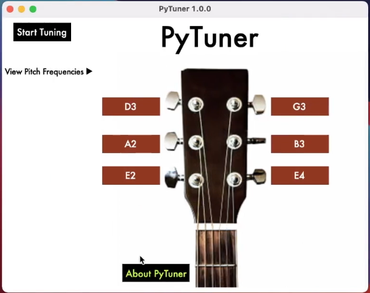

# The PyTuner Project

PyTuner was my first serious programming project, which I made for submission to a local technology competition. Through this project I learned alot about Graphical User Interaces (GUIs) and complex data structures within desktop applications. I used fast fourier transforms and other calculus principles to transform audio from a raw guitar pluck to a message that tells the user whether or not their string is out of tune.



## YIN Algorithm

The YIN algorithm converts waveform-based audio to a signular pitch, which is the entire goal of a guitar tuner.

I used `sounddevice` to record audio and `numpy` to perform computations.

The python code for the algorithm is as follows:
```python
def YIN(sig, sr, wl=882, ws=441, f0_min=50,
        f0_max=500, ht=0.1):
    """

    Implement the YIN algorithm. Notice how 
    differenceFunction, cummalative_mean_norm_df, and pitch
    are all helper functions for this tool.

    Parameters:
    --------------
    sig iterable:
        numpy array of audio
    sr int:
        samplerate
    wl=882 int:
        length of calculation window for pitch
    ws=441 int:
        step for calculation window
    f0_min=50 int:
        minimum frequency threshold
    f0_max=500 int:
        maximum frequency threshold
    ht=0.1 float:
        harmonic threshold

    """

    t_min = int(sr / f0_max)
    t_max = int(sr / f0_min)

    timeScale = range(0, len(sig) - wl, ws)
    times = [t/float(sr) for t in timeScale]
    frames = [sig[t:t + wl] for t in timeScale]

    pitches = [0.0] * len(timeScale)
    harmonic_rates = [0.0] * len(timeScale)
    argmins = [0.0] * len(timeScale)

    for i, frame in enumerate(frames):

        # Compute YIN
        df = differenceFunction(frame, wl, t_max)
        CMNDF = cummalative_mean_norm_df(df, wl)
        p = pitch(CMNDF, t_min, t_max, ht)

        # Get results
        if np.argmin(CMNDF) > t_min:
            argmins[i] = float(sr / np.argmin(CMNDF))
        if p != 0:  # A pitch was found
            pitches[i] = float(sr / p)
            harmonic_rates[i] = CMNDF[p]
        else:
            harmonic_rates[i] = min(CMNDF)

    return pitches, harmonic_rates, argmins, times
```

## Graphical User Interface

For the graphical user interface, I used a library called `Tkinter`, a simple python library for GUI development. Here is a sample of Tkinter code for a simple dropdown, implemented using object-oriented programming (OOP):

```python
import tkinter as tk
from tkinter import ttk


class LabelDropdown(tk.Frame):
    """
    Dropdown - like object which projects a multiline string to GUI
    see LabelDropdown.__init__ for more details.
    """


    def __init__(self, master, label, buttonlabel, label_font, label_fg, label_bg,
                 buttonlabel_font, buttonlabel_fg, buttonlabel_bg, indent='  '):
        """__init__.

        Parameters
        ----------
        master : tk.Tk
            master
        label : str
            label
        buttonlabel : str
            label for button
        label_font : str
            font for button
        label_fg : str
            forground for button
        label_bg : str
            background for button
        buttonlabel_font : str
            font for button
        buttonlabel_fg : str
            foreground for button
        buttonlabel_bg : str
            background for button
        indent : str
            indentation for label
        """
        super(LabelDropdown, self).__init__()
        self['background'] = '#ffffff'
        self.label = label
        self.buttonlabel = buttonlabel
        self.label_font = label_font
        self.label_fg = label_fg
        self.label_bg = label_bg
        self.buttonlabel_font = buttonlabel_font
        self.buttonlabel_fg = buttonlabel_fg
        self.buttonlabel_bg = buttonlabel_bg
        self.indent = indent
        self.button = ttk.Button(self, text=self.buttonlabel+' ▶', style='DD.TButton', command=self.show)
        self.button.grid(row=0, column=0)
        self.style_init()
    def show(self):
        """
        Show Label
        """
        self.button['command'] = self.hide
        self.button['text'] = self.buttonlabel + ' ▼'
        self.label_list = self.label.split('\n')
        self.label_widgets = []
        if len(self.label_widgets) == 0:
            for i in range(len(self.label_list)):
                self.label_list[i] = self.indent+self.label_list[i] # notice that indent.join(label_list) would leave out the first line.
                self.label_widgets.append(ttk.Label(self, text=self.label_list[i], style='DD.TLabel'))
                self.label_widgets[i].grid(row=i+1, column=0)
        else:
            for i in range(len(self.label_widgets)):
                self.label_widgets[i].grid(row=i+1,column=0)
    def hide(self):
        """
        Hide Docstring
        """
        self.button['command'] = self.show
        self.button['text'] = self.buttonlabel + ' ▶'
        for i in self.label_widgets:
            i.grid_forget()
    def style_init(self):
        """
        initialize styles
        """
        self.style = ttk.Style(self)
        self.style.configure('DD.TLabel',
                             font=self.buttonlabel_font,
                             foreground=self.buttonlabel_fg,
                             background=self.buttonlabel_bg,
                             relief='flat', pady=10)
        self.style.configure('DD.TButton',
                             font=self.buttonlabel_font,
                             foreground=self.buttonlabel_fg,
                             background=self.buttonlabel_bg,
                             relief='flat')
        self.style.map('DD.TButton',
                       foreground=[('active', '#000000')],
                       background=[('active', '#ffffff')])
        self.style.layout('DD.TButton',
                          [('Button.button',
                            {'sticky': 'nswe', 'children': 
                                #[('Button.padding', {'sticky': 'nswe', 'children': 
                                    [('Button.label', {'sticky': 'nswe'})]
                                   # })]
                                })]
                          )
```

<p class="text-center">

</p>
