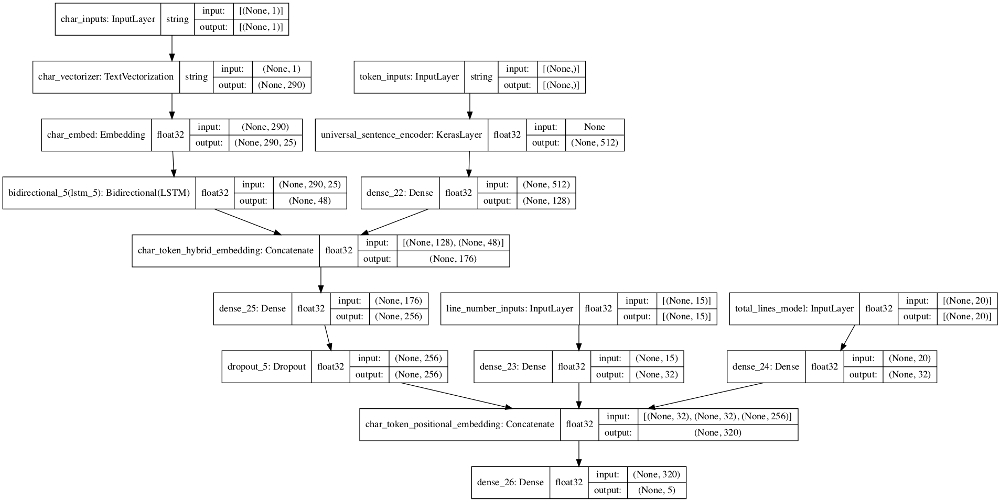

# SkimLit

SkimLit, short for skim literature, is a project I made in the summer of my 7th grade year, and was what truly attracted my to Artificial Intelligence as a focus in computer science. Using TensorFlow and NLP techniques, I trained a tribrid machine learning model capable of categorizing sentences of medical abstracts into respective parts of a research paper. For example:

*Before:* Currently, there is confusion about the value of using nutritional support to treat malnutrition and improve functional outcomes in chronic obstructive pulmonary disease (COPD). This systematic review and meta-analysis of randomized, controlled trials (RCT) aimed to clarify the effectiveness of nutritional support in improving functional outcomes in COPD. A systematic review identified 12 RCT (n = 448) in stable COPD patients investigating the effects of nutritional support (dietary advice (1 RCT), oral nutritional supplements (10 RCT), enteral tube feeding (1 RCT)) versus control on functional outcomes. Meta-analysis of the changes induced by intervention found that while respiratory function (forced expiratory volume in 1 s, lung capacity, blood gases) was unresponsive to nutritional support, both inspiratory and expiratory muscle strength (maximal inspiratory mouth pressure +3.86 standard error (SE) 1.89 cm H2 O, P = 0.041; maximal expiratory mouth pressure +11.85 SE 5.54 cm H2 O, P = 0.032) and handgrip strength (+1.35 SE 0.69 kg, P = 0.05) were significantly improved and associated with weight gains of ≥2 kg. Nutritional support produced significant improvements in quality of life in some trials, although meta-analysis was not possible. It also led to improved exercise performance and enhancement of exercise rehabilitation programmes. This systematic review and meta-analysis demonstrates that nutritional support in COPD results in significant improvements in a number of clinically relevant functional outcomes, complementing a previous review showing improvements in nutritional intake and weight.

*After:*
----
*BACKGROUND*:  Currently, there is confusion about the value of using nutritional support to treat malnutrition and improve functional outcomes in chronic obstructive pulmonary disease (COPD).
*OBJECTIVE*:  This systematic review and meta-analysis of randomized, controlled trials (RCT) aimed to clarify the effectiveness of nutritional support in improving functional outcomes in COPD.
*METHODS*:  A systematic review identified 12 RCT (n = 448) in stable COPD patients investigating the effects of nutritional support (dietary advice (1 RCT), oral nutritional supplements (10 RCT), enteral tube feeding (1 RCT)) versus control on functional outcomes.
*RESULTS*:  Meta-analysis of the changes induced by intervention found that while respiratory function (forced expiratory volume in 1 s, lung capacity, blood gases) was unresponsive to nutritional support, both inspiratory and expiratory muscle strength (maximal inspiratory mouth pressure +3.86 standard error (SE) 1.89 cm H2 O, P = 0.041; maximal expiratory mouth pressure +11.85 SE 5.54 cm H2 O, P = 0.032) and handgrip strength (+1.35 SE 0.69 kg, P = 0.05) were significantly improved and associated with weight gains of ≥2 kg.
*CONCLUSIONS*:  Nutritional support produced significant improvements in quality of life in some trials, although meta-analysis was not possible. It also led to improved exercise performance and enhancement of exercise rehabilitation programmes. This systematic review and meta-analysis demonstrates that nutritional support in COPD results in significant improvements in a number of clinically relevant functional outcomes, complementing a previous review showing improvements in nutritional intake and weight.

This was achieved by using a tribrid model that used the line numbers, total lines, sentences, and characters of each abstract and pass them through a neural network with 3 layers of embedding, allowing for highly complex text-based representations to be learned.

Here is a picture of what this looks like:


## Tensorflow Code (functional API):

```python
# 1. Token-level model
token_inputs = layers.Input(shape=[], dtype=tf.string, name="token_inputs")
token_embeddings = tf_hub_embedding_layer(token_inputs)
token_outputs = layers.Dense(128, activation="relu")(token_embeddings)
token_model = tf.keras.Model(token_inputs, token_outputs, name="token_level_model")

# 2. Character-level model
char_inputs = layers.Input(shape=(1,), dtype=tf.string, name="char_inputs")
char_vectors = char_vectorizer(char_inputs)
char_embeddings = char_embed(char_vectors)
char_bi_lstm = layers.Bidirectional(layers.LSTM(24, activation="tanh"))(char_embeddings)
char_model = tf.keras.Model(inputs=char_inputs,
                            outputs=char_bi_lstm,
                            name="char_level_model")

# 3. Line numbers model
line_number_inputs = layers.Input(shape=(15,), dtype=tf.float32, name="line_number_inputs")
# Positional Embedding
# Dense is technically an embdding layer for one-hot data
line_number_outputs = layers.Dense(32, activation="relu")(line_number_inputs)
line_number_model = tf.keras.Model(line_number_inputs,
                                   line_number_outputs,
                                   name="line_number_model")

# 4. Total lines model
total_lines_inputs = layers.Input(shape=(20,), dtype=tf.float32, name="total_lines_model")
# Positional Embedding
# Dense is technically an embdding layer for one-hot data (as in step 3)
total_lines_outputs = layers.Dense(32, activation="relu")(total_lines_inputs)
total_lines_model = tf.keras.Model(total_lines_inputs,
                                   total_lines_outputs,
                                   name="total_lines_model")

# 5. Concatenate Token and Char Embeddings in to a Hybrid Embedding
combined_embeddings = layers.Concatenate(name="char_token_hybrid_embedding")([token_model.output,
                                                                              char_model.output])
# 6. Pass combined outputs into a Dropout layer
combined_dense = layers.Dense(256, activation="relu")(combined_embeddings)
combined_dropout = layers.Dropout(0.5)(combined_dense)

# 7. Concatenate the outputs of 3, 4, & 5 into a Tribrid Embedding (combine positional embddings with combined token and char embeddings)
tribrid_embeddings = layers.Concatenate(name="char_token_positional_embedding")([line_number_model.output,
                                                                                 total_lines_model.output,
                                                                                 combined_dropout])

# 8. Create output layer(s)
output_layer = layers.Dense(num_classes, activation="softmax")(tribrid_embeddings)

# 9. Put together model with all kinds of inputs
model_5 = tf.keras.Model(inputs=[line_number_model.input,
                                 total_lines_model.input,
                                 token_model.input,
                                 char_model.input],
                         outputs=output_layer,
                         name="model_5_tribrid_positional_char_token_model")
```

<p class="text-center">

</p>